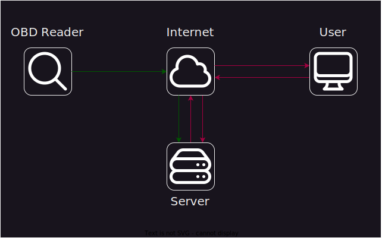

# Predictive Maintenance
Das Projekt "Predictive Maintenance" wurde beim [Hackathon](https://github.com/FeuerwehrHackathon2024) der [Freiwilligen Feuerwehr München](https://www.ffw-muenchen.de/) konzeptioniert und bereits vorgestellt. Die technische Umsetzung konnte leider noch nicht erfolgen aufgrund von fehlenden Hardware-Komponenten

## Ziele
- Wartungsbedarf an Fahrzeugen frühzeitig erkennen
- Erleichterung der Wartung
- Fuhrparkverwaltung

## Wie funktionierts?

Durch ein Gerät welches an den [OBD Port](https://de.wikipedia.org/wiki/On-Board-Diagnose) des jeweiligen Fahrzeuges angeschlossen wird, können Informationen vom Fahrzeug ausgelesen werden.
Diese können dann durch das Internet an einen Server der FFM übermittelt werden und gleichzeitig ausgewertet werden. Die Ausgabe kann dann durch eine (Web-) Applikation erfolgen.

## Mögliche Informationen
- DTC
- Aktuelle Motordrehzahl
- Gefahrene Geschwindigkeit
- Kraftstoffdruck
- Kühlmitteltemperatur
- ...

## Benötigte Ressourcen
- OBD Reader mit WLAN / GSM funktion
- Server zum Speichern & Auswerten
